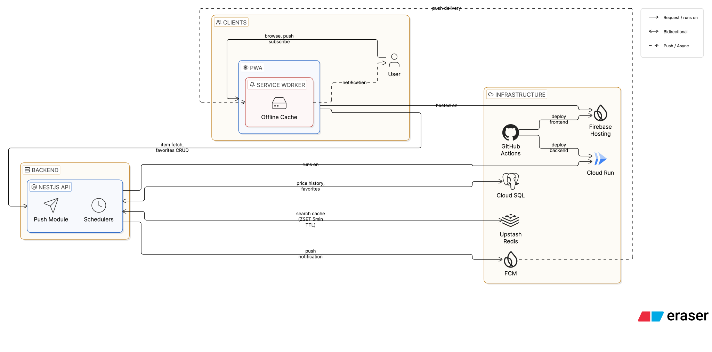
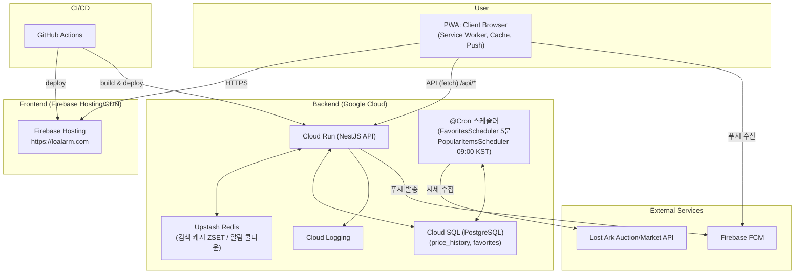

<div align="center">
  
</div>

# 🔔 LoAlarm (로알람) - 로스트아크 거래소/경매장 시세 알림 웹앱

로알림은 스마일게이트 RPG의 게임 ‘로스트아크’ 거래소 시세를 확인하고, 가격 알림을 받을 수 있는 웹앱(PWA)입니다. 모바일에서도 바로 실행되며, 홈 화면에 추가하여 앱처럼 사용할 수 있습니다. 본 서비스는 스마일게이트 RPG의 공식 서비스가 아닌, 팬메이드 비공식 도구입니다.

개발 기간 : 2025.09 - 2025.10 (약 2주간 집중 개발)

## 기획 의도 (Planning)

개인적으로 원하는 매물을 찾기 위해 매번 공식 홈페이지의 경매장이나 거래소에 접속해 2차 본인인증을 거치는 과정이 너무 번거로웠습니다.
모바일로 접속해서 시세를 확인하는 것도 불편하다고 느꼈어요.
특히 다른 일을 하다가 “어, 지금 싸졌네?” 싶은 순간 바로 사고 싶어도, 매번 들어가서 검색해야 하는 게 귀찮더라고요.
그래서 “원하는 아이템이 원하는 가격일 때 자동으로 알려주는 서비스가 있으면 얼마나 편할까?” 하는 생각으로 개발을 시작했습니다.

## 배포 링크 (Demo)

👉 [프로젝트 링크](https://loalarm.com)

📱 [앱 다운로드 가이드](https://loalarm.com/push-help)

## 주요 기능 (Features)

- 📊 주요 재료 시세 대시보드: 21종 재료 일별 시세 자동 수집, 그룹별 차트 (로그인 불필요)
- 📑 시세 집계: 거래소/경매장 아이템을 한 화면에 비교
- 📈 최근가 그래프: 일/주 단위 변동 추적
- ⭐ 즐겨찾기: 관심 품목 묶음
- 🔔 가격 알림: 목표가 도달 시 푸시/브라우저 알림
- 📱 PWA: 홈 화면 추가, 오프라인 캐시


## 서비스 화면 (Pages)

| 메인 대시보드 | 즐겨찾기 | 알림 설정 | 푸시 알림 |
| :--: | :--: | :--: | :--: |
| <div align="center"></div> | <div align="center"></div> | <div align="center"></div> | <div align="center"></div> |


## 기술 스택 (Tech Stack)

### Frontend


### Backend


### Infrastructure


### CI/CD


## 시스템 아키텍처 (Architecture)





## 시작 가이드 (Get Started)

### 로컬 개발 환경 설정

#### 1. 저장소 클론

```bash
git clone https://github.com/jyjww/LoaPwa.git
cd LoaPwa
```

#### 2. 환경 변수 설정

`Backend/.env` 파일을 생성하고 아래 환경 변수를 채워주세요.

#### 3. 로컬 실행 (dev.sh)

Docker로 DB·백엔드를 띄우고, 로컬에서 프론트엔드를 실행합니다.

```bash
chmod +x dev.sh
./dev.sh dev       # DB + 백엔드(Docker) + 프론트엔드(로컬) 한번에 실행
./dev.sh logs      # 전체 로그 확인
./dev.sh down      # 컨테이너 종료
./dev.sh reset-dev # 볼륨 초기화 후 재시작
```

### 환경 변수 설정

#### Backend/.env

```env
DB_HOST=localhost
DB_PORT=5432
DB_NAME=loa
DB_USER=loa
DB_PASSWORD=your-db-password
REDIS_URL=redis://localhost:6379
LOSTARK_API_KEY=your-lostark-api-key
API_ENCRYPTION_KEY=your-encryption-key
FCM_CLIENT_EMAIL=your-firebase-client-email
FIREBASE_SA_JSON=your-firebase-service-account-json
```

#### PwaFrontend/.env

```env
VITE_API_URL=http://localhost:4000/api
VITE_FCM_VAPID_KEY=your-vapid-key
```

### 주요 디렉토리 구조

```
LoaPwa/
├── Backend/                # NestJS 백엔드
│   ├── src/
│   │   ├── auth/           # 인증 모듈 (Google OAuth, 익명 세션)
│   │   ├── auctions/       # 경매장 API
│   │   ├── favorites/      # 즐겨찾기 & 가격 알림 스케줄러
│   │   ├── fcm/            # 푸시 알림
│   │   ├── markets/        # 거래소 API & 검색 캐시
│   │   └── prices/         # 시세 히스토리 & 주요 재료 스케줄러
│   └── Dockerfile.prod
├── PwaFrontend/            # React 프론트엔드
│   ├── src/
│   │   ├── components/     # 재사용 컴포넌트
│   │   ├── pages/          # 페이지 컴포넌트
│   │   ├── services/       # API 서비스
│   │   └── hooks/          # 커스텀 훅
│   └── public/
│       └── firebase-messaging-sw.js  # FCM Service Worker
├── dev.sh                  # 로컬 개발 실행 스크립트
└── docker-compose.yml      # 로컬 DB & 백엔드 컨테이너
```

## 라이선스 (License)

This project is licensed under the **MIT License**.
